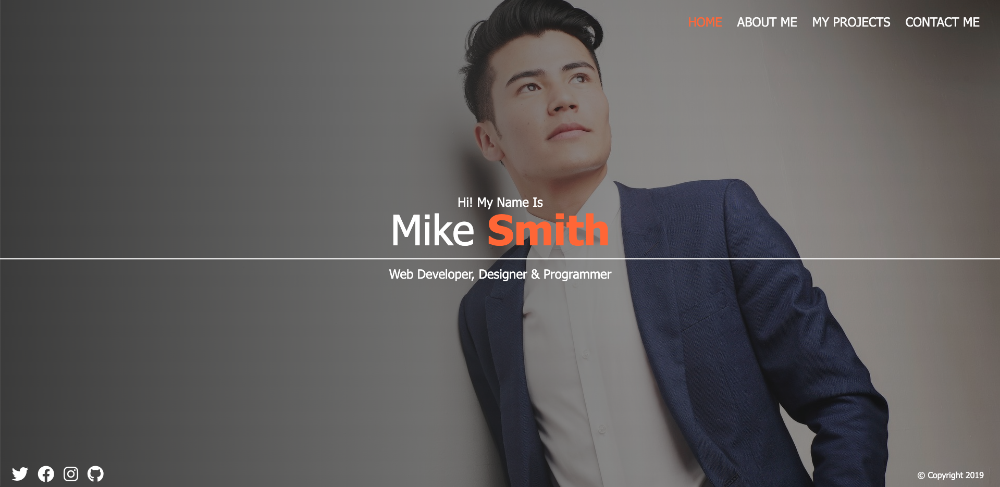

# Sass Portfolio

> ### Project is a tutorial. Credit to [freeCodeCamp.org](https://www.youtube.com/watch?v=_a5j7KoflTs)

Although this was my first experience with Sass, I am hooked! I love how Sass allows users to write cleaner CSS and use JavaScript-like logic. I will definitely be implementing Sass in all my future projects.

[Deployment](https://dzamanillo.github.io/sass-portfolio/dist/index.html)

